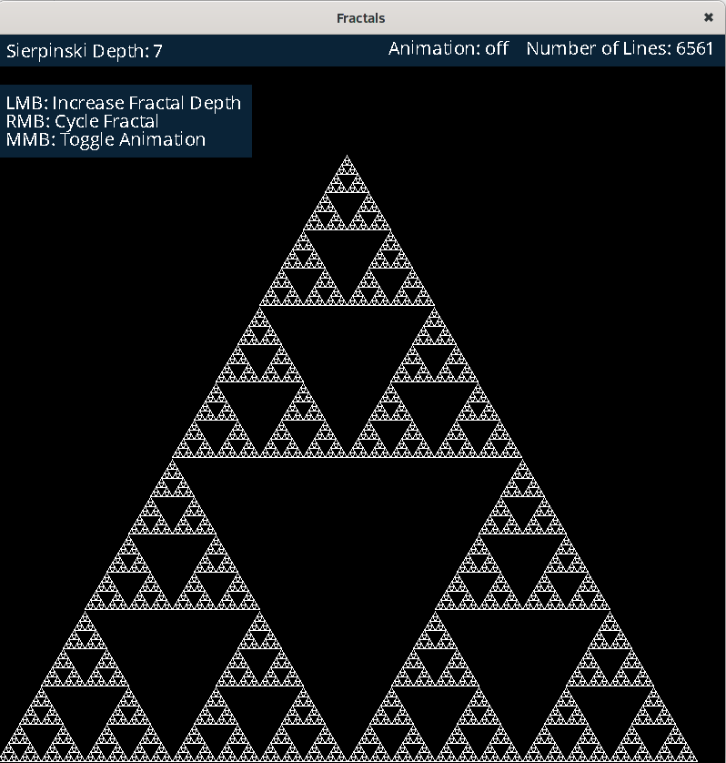
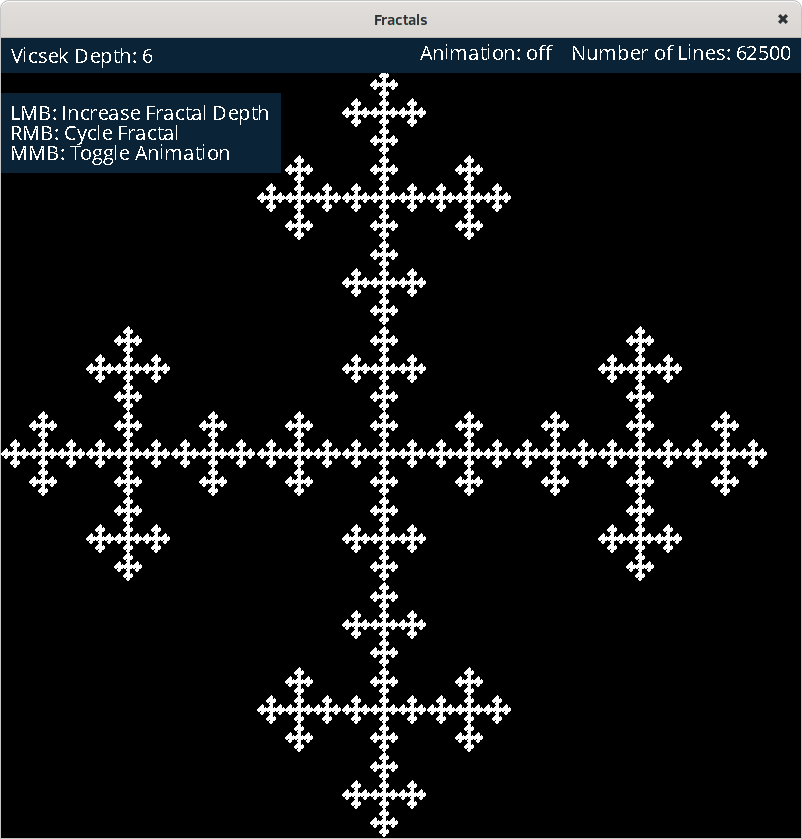
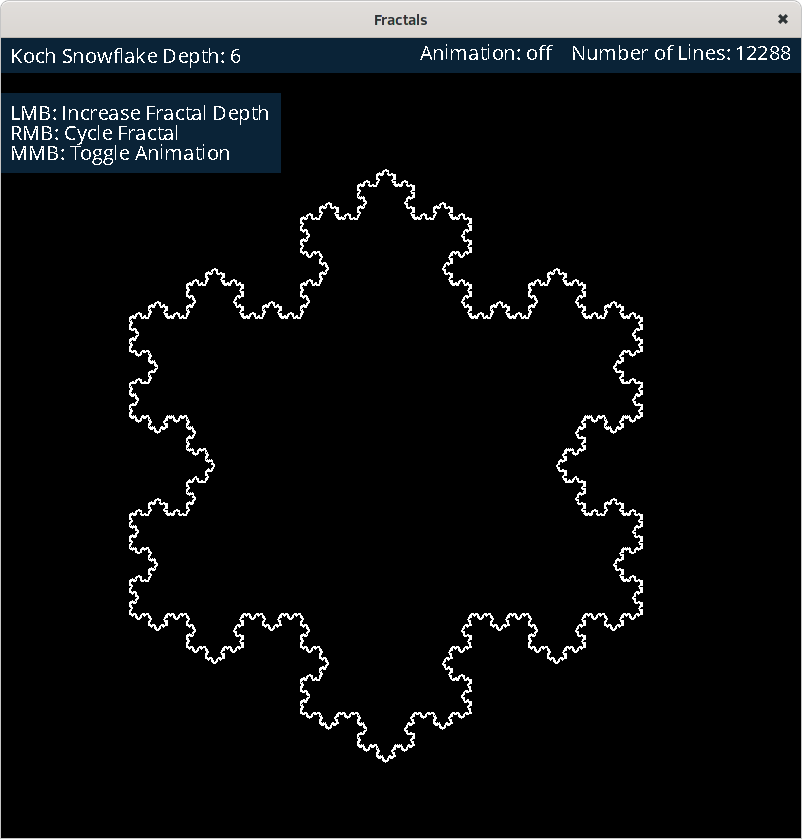
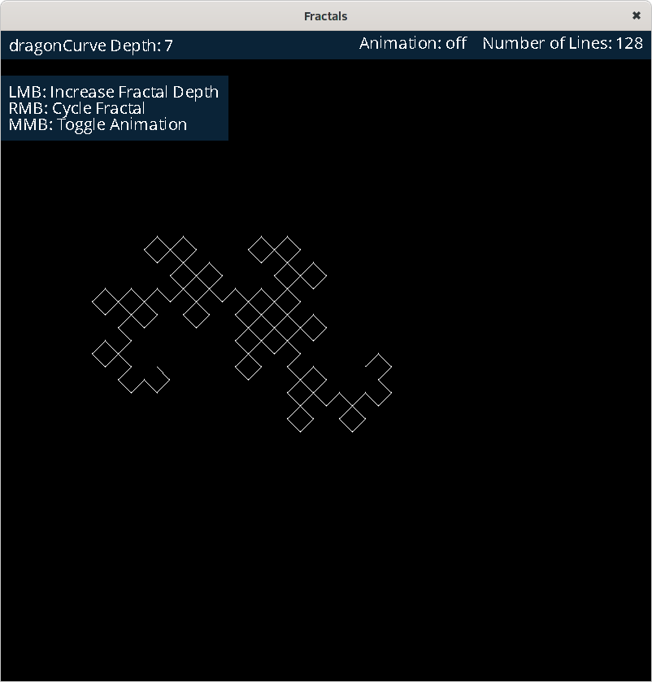
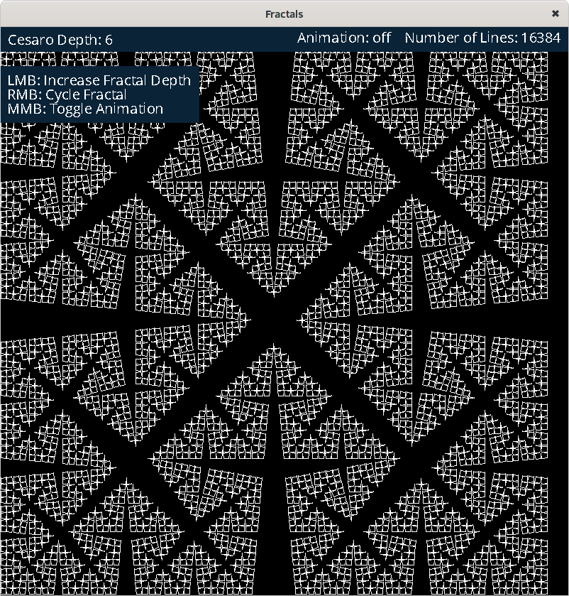

# Fractals
A Scala native fractal generator.

Sierpinski Triangle


## First runners
You need to install llvm, sdl2 and bdw-gc to your system.

### MacOS

```
brew install llvm sdl2 sdl2_ttf bdw-gc
```

### Linux (tested on Ubuntu 18.04)

```
sudo apt install llvm
sudo apt install libsdl2-dev
sudo apt install libgc-dev
```

It is also needed clang and libunwind-dev.
```
sudo apt install clang
sudo apt install libunwind-dev
```

### Running

After that `sbt run` will start and run the project.

For the implemented fractals you can add the number of the implementation as command line parameter. (for ex. `sbt "run 3"`)

You can use left mouse button to add more detail/depth to the actual fractal.
You can use right mouse button to iterate between the fractals.
You can use middle mouse button to animate the actual fractal.

## List of implemented fractals

- 0: sierpinski


- 1: vicsek


- 2: vicsekx


- 3: cantorDust


- 4: kochCurve


- 5: kochSnowflake


- 6: Tree


- 7: sierpinski carpet

 
- 8: dragon curve 


- 9: H fractal 


- 10: Minkowski Sausage 


- 11: Cesaro 

